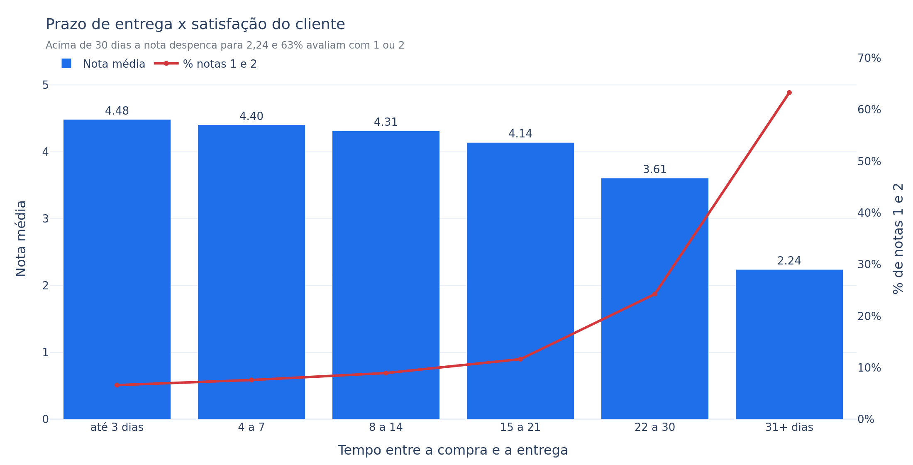
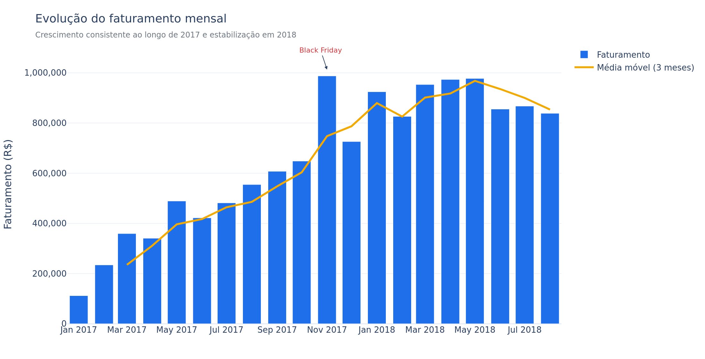
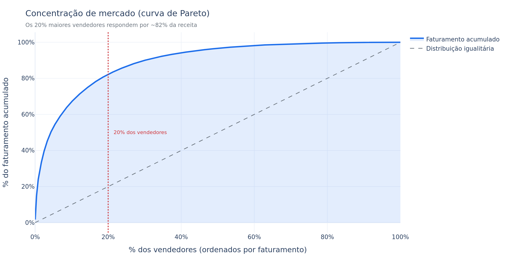
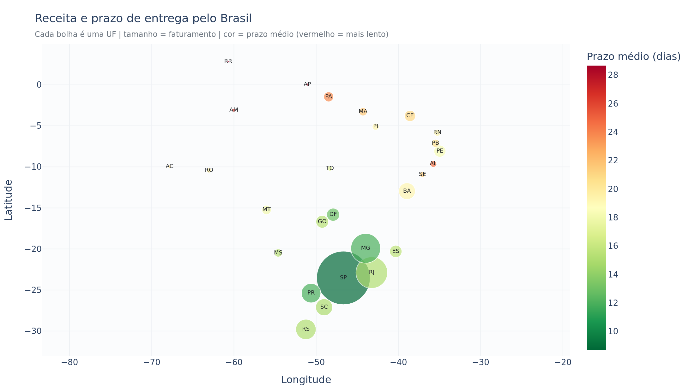
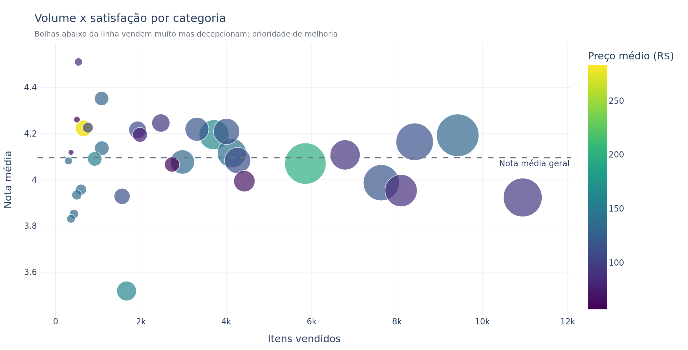

# 📦 Olist — Análise de Performance de Vendas

Análise exploratória e **dashboard interativo** sobre 96 mil pedidos entregues do maior
marketplace brasileiro (Olist), construídos com Python, Pandas, Plotly e Streamlit.

> **A pergunta central do projeto:** onde estão as alavancas de crescimento e de
> satisfação de um marketplace com R$ 13,2 milhões em vendas?

---

## 🎯 Principais descobertas

| # | Descoberta | Número |
|---|-----------|--------|
| 1 | **Atraso na entrega derruba a avaliação** — o achado mais acionável da base | Nota **4,29** no prazo → **2,57** atrasado |
| 2 | **Pareto real entre vendedores**: o topo não domina, mas o núcleo sim | **18%** dos vendedores geram **80%** da receita |
| 3 | **Concentração geográfica extrema** no Sudeste | SP, RJ e MG = **63%** da receita |
| 4 | **Custo de vender longe**: frete e prazo penalizam o Norte/Nordeste | Frete = **22,7%** do preço no Norte vs. 13,1% no Sudeste |
| 5 | **Parcelamento sustenta o ticket** | R$ 101 à vista → **R$ 333** em 7-10x |

**A leitura de negócio:** logística é o produto. Só 8,1% dos pedidos atrasam, mas
46% deles recebem nota 1 — o problema é concentrado e, por isso, tratável.
Reduzir atraso vale mais para o NPS do que qualquer campanha de marketing.

---

## 📊 Dashboard interativo

```bash
streamlit run app.py
```

Seis abas com filtros globais por **período, região, categoria e faixa de preço**:

| Aba | O que responde |
|-----|----------------|
| 📈 Visão geral | A receita cresce? Quando o cliente compra? |
| 🛍️ Produtos | Quais categorias sustentam a receita e quais decepcionam? |
| 🏪 Vendedores | O mercado é concentrado? Quem vende muito e avalia mal? |
| 🗺️ Geografia | Onde está o dinheiro e onde a entrega falha? |
| 🚚 Entrega & Satisfação | Qual o impacto real do prazo na nota? Como o cliente paga? |
| 🗂️ Dados | Metodologia, amostra da base e download em CSV |

---

## 🔍 Alguns dos gráficos

### Prazo de entrega x satisfação — o insight central


Cada faixa de atraso derruba a nota. Acima de 30 dias, **63% das avaliações são 1 ou 2**.

### Evolução do faturamento


Crescimento forte em 2017, estabilização em ~R$ 900 mil/mês em 2018. O pico de
nov/2017 é a Black Friday — e dezembro **cai**, porque o cliente antecipa a compra
de Natal sabendo que a entrega demora.

### Concentração de mercado (Pareto)


Os 10 maiores vendedores fazem só 13,3% da receita — parece pulverizado. Mas a curva
completa revela um Pareto clássico: **531 vendedores (18%) geram 80% do faturamento**.

### Receita e prazo pelo Brasil


Tamanho = faturamento, cor = prazo médio. Quanto mais ao norte, mais lenta a entrega
e menor a receita. *(No dashboard este mapa é interativo, com tiles reais.)*

### Volume x satisfação por categoria


Categorias abaixo da linha vendem muito e decepcionam — prioridade de melhoria.
**Móveis de escritório** (nota 3,52) e **cama, mesa e banho** (3,92) lideram esse
grupo: itens volumosos, frete caro e maior risco de avaria.

> As 17 figuras (PNG + HTML interativo) estão em [`outputs/figuras/`](outputs/figuras)
> e as tabelas de resumo em [`outputs/tabelas/`](outputs/tabelas).

---

## 🚀 Como rodar

```bash
# 1. Clonar e entrar no projeto
git clone https://github.com/sergiomeyer23/olist-sales-performance-analysis.git
cd olist-sales-performance-analysis

# 2. Ambiente virtual
python -m venv .venv
source .venv/bin/activate        # Windows: .venv\Scripts\activate

# 3. Dependências
pip install -r requirements.txt

# 4. Dashboard interativo
streamlit run app.py

# 5. (Opcional) Gerar todas as figuras e tabelas estáticas
python gerar_relatorio.py

# 6. (Opcional) Rodar os testes
pytest -q                        # 22 testes: métricas + dashboard
```

Os CSVs já estão em `dados/`. A fonte original é o
[Brazilian E-Commerce Public Dataset by Olist](https://www.kaggle.com/datasets/olistbr/brazilian-ecommerce) (Kaggle).

---

## 🗂️ Estrutura do projeto

```
olist-sales-performance-analysis/
├── app.py                      # Dashboard Streamlit (6 abas, filtros globais)
├── gerar_relatorio.py          # Exporta 17 figuras + 6 tabelas para outputs/
├── requirements.txt
├── src/
│   ├── config.py               # Caminhos, regras de negócio, paleta e labels
│   ├── data_loader.py          # Limpeza dos 9 CSVs → tabela analítica (cache Parquet)
│   ├── analysis.py             # 20 funções de análise (só cálculo, sem gráfico)
│   └── plots.py                # 18 funções de gráfico (só desenho, sem cálculo)
├── notebooks/
│   └── 01_analise_exploratoria.py   # A investigação narrada, passo a passo
├── tests/
│   ├── test_analysis.py        # 16 testes de sanidade das métricas
│   └── test_app.py             # 6 testes do dashboard (AppTest do Streamlit)
├── dados/                      # CSVs brutos do Kaggle
└── outputs/
    ├── figuras/                # PNG (README) + HTML (interativo)
    └── tabelas/                # Resumos em CSV
```

**Por que essa separação?** `analysis.py` só calcula e `plots.py` só desenha. Assim o
mesmo número alimenta o dashboard, o relatório estático e os testes — sem risco de
uma métrica ser calculada de duas formas diferentes em lugares diferentes.

### ✅ Testes

```bash
pytest -q     # 22 passed
```

- **`test_analysis.py`** — garante o que não pode quebrar: os joins não duplicam
  itens, o faturamento mensal bate com o total, a curva de Pareto é monotônica e
  termina em 100%, e o insight central (atraso derruba a nota em mais de 1 estrela)
  continua valendo.
- **`test_app.py`** — executa o dashboard de verdade com o `AppTest` do Streamlit.
  Foi ele que pegou um `IndexError` real: com filtros muito restritivos (ex.: Norte +
  Livros) o recorte podia não ter nenhum pedido atrasado, e a comparação
  "no prazo x atrasado" quebrava o app.

---

## 🧹 Tratamento dos dados

Decisões tomadas na limpeza (documentadas em `src/data_loader.py`):

| Decisão | Motivo |
|---------|--------|
| Só pedidos com status `delivered` | Cancelados e indisponíveis inflariam o faturamento sem receita real |
| Recorte de **jan/2017 a ago/2018** | Os meses das pontas têm 1 a 4 pedidos e distorcem qualquer série temporal |
| Uma avaliação por pedido (a mais recente) | 551 pedidos têm avaliação duplicada; sem tratar, o join multiplicaria as linhas |
| Um meio de pagamento por pedido (o de maior valor) | Pedidos com voucher + cartão apareceriam duas vezes |
| Produtos sem categoria → `uncategorized` | ~1,6k produtos; descartá-los tiraria receita real da análise |
| Frete separado do faturamento | Faturamento = preço dos produtos; frete é analisado como custo logístico |

Granularidade final: **uma linha = um item vendido e entregue** (109.872 linhas).

---

## 💡 Recomendações de negócio

1. **Atacar o atraso antes de qualquer coisa.** 8,1% dos pedidos atrasam e custam
   1,73 estrela cada. É o maior ganho de NPS disponível.
2. **Gestão de vendedores em dois trilhos.** Conta dedicada para os ~530 que fazem
   80% da receita; autoatendimento e automação para a cauda longa.
3. **Centro de distribuição no Nordeste.** Ataca simultaneamente prazo (20 dias),
   frete (22% do preço) e nota (3,91, a pior do país).
4. **Revisar categorias volumosas.** Móveis e cama/mesa/banho vendem bem e avaliam
   mal: embalagem melhor e prazo realista no anúncio.
5. **Preparar a operação para novembro.** A Black Friday é o pico de receita — e
   justamente quando o risco de atraso (e de nota 1) mais cresce.

---

## 🛠️ Tecnologias

`Python 3.11` · `Pandas` · `NumPy` · `Plotly` · `Streamlit` · `PyArrow` · `Pytest`

---

## 📈 Possíveis próximos passos

- Análise **RFM** e coortes de retenção de clientes
- Modelo de **previsão de atraso** na entrega (classificação)
- Previsão de demanda por categoria (séries temporais)
- Deploy do dashboard no Streamlit Community Cloud

---

Projeto de portfólio em análise de dados por
[@sergiomeyer23](https://github.com/sergiomeyer23).
